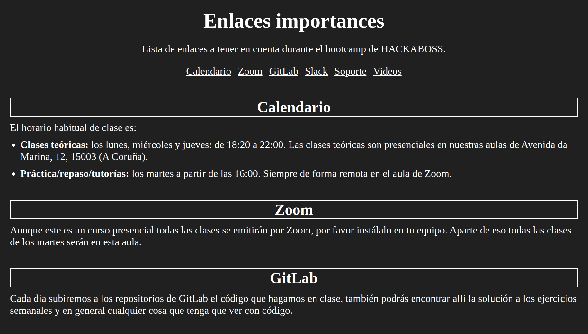
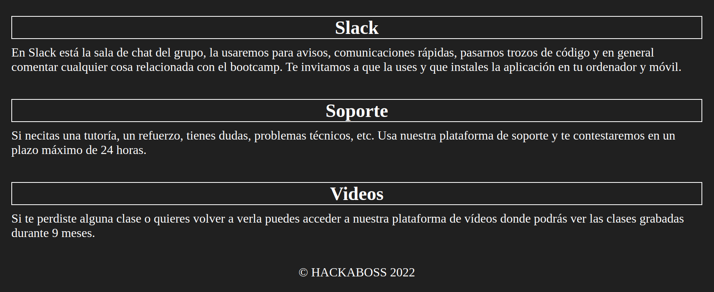

# Ejercicio 1

Aplica al `index.html` un diseño similar al de las imagenes que acompañan a este documento sin modificar el html.

Todos los colores han de ser aplicados mediante el uso de variables personalizadas que han de ser declaradas en el elemento raíz (etiqueta `<html>`).

Posteriormente importa la tipografía que más te guste de Google Fonts y aplica los siguientes
grosores:

-   Todos los párrafos y elementos `<li>` que se encuentren dentro de una sección han de tener un grosor de 300.

-   Todos los `<h2>` han de tener un grosor de 400.

-   El elemento `<h1>` ha de tener un grosor de 500.

-   Todos los enlaces han de tener un grosor de 400 y estar en cursiva.

Dado que apenas hemos hablado de los márgenes y los paddings en clase no es necesario que lo pongas en práctica. No importa que el diseño no quede exactamente igual que en las imágenes, pero si te animas a intentarlo adelante. A priori no es necesario agregar ningún padding, solo márgenes.

Al finalizar el ejercicio cada persona debe crear un repositorio en GitLab y subir el código. El nombre del repositorio ha de ser `ejercicio-parejas-s2`.

P.D: no dudes en apoyarte del navegador para solventar cualquier duda si es necesario. Aprender a buscar información forma parte del día a día de un programador.
