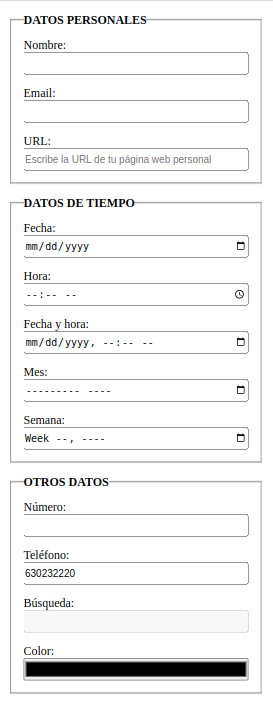
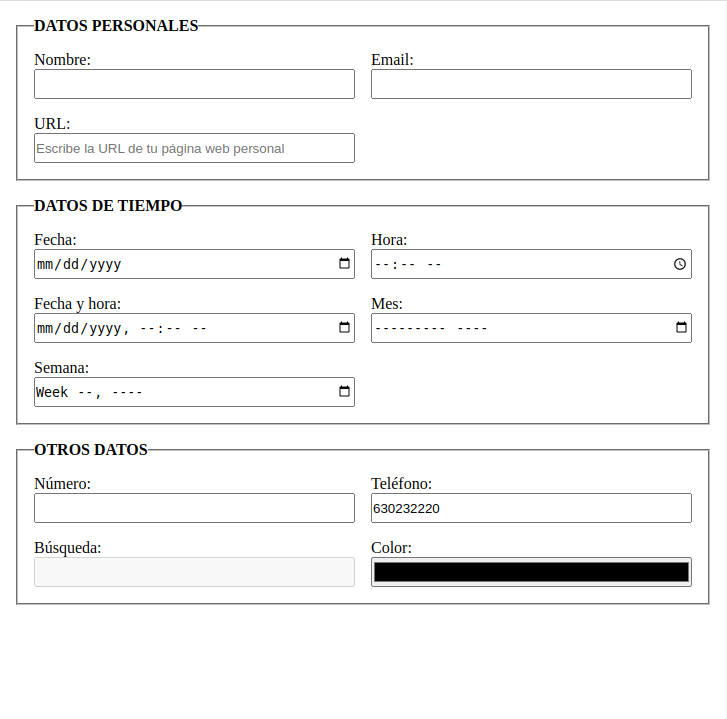
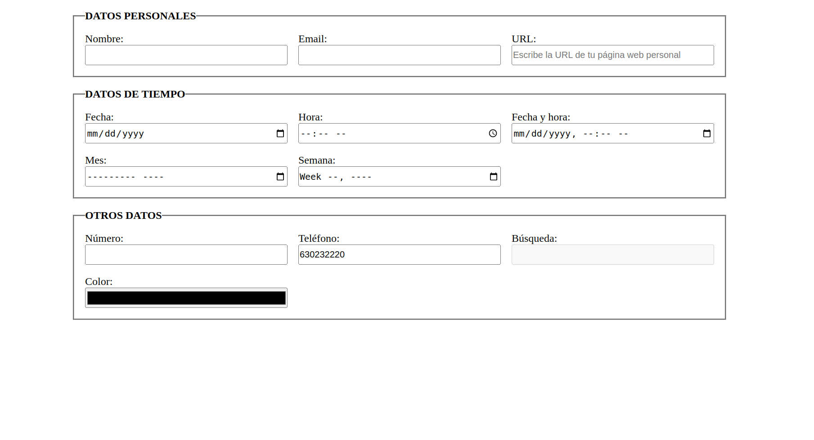

# Ejercicio 1

Utiliza lo aprendido sobre grid para crear una página responsive a partir del `index.html` dado.

-   Todos los `label` han de estar sobre su `input` correspondiente y no al lado.

-   Todos los `input` han de tener un ancho del 100% del tamaño del contenedor.

-   El formulario ha de tener un ancho máximo de 1000px y ha de estar centrado horizontalmente.

-   Los márgenes y paddings quedan a elección del programador o programadora.

## Diseño para móvil

## Diseño para tablet

## Diseño para desktop

